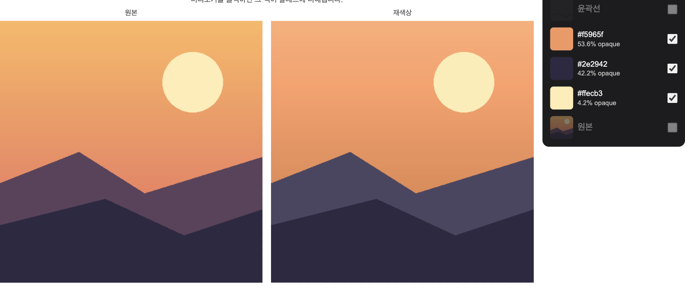

<h1 align="center">컬러 팔레트 추출기</h1>

<p align="center">
  <a href="https://github.com/Chokoty/colorPalleteGenerate"></a>
  
  
  
</p>

<p align="center">
  <strong>이미지를 올리면 대표 색을 뽑고, 그 색으로 다시 칠하고, 레이어로 쪼개 보여줍니다.</strong><br/>
  클러스터링도 선화 추출도 전부 브라우저 안에서 돕니다. 이미지는 어디로도 나가지 않습니다.
</p>

<p align="center">
  <a href="https://color-pallete-generate.vercel.app"><strong>color-pallete-generate.vercel.app →</strong></a>
</p>

<p align="center">
  
</p>

## 기능

<table>
<tr>
<td width="50%" valign="top">

### 두 가지 추출 방식

직접 설정은 K-Means로 지정한 개수만큼 클러스터링합니다. 자동 추출은 이미지에 실제로 존재하는 색만 모아 ΔE(CIE76) 기준 18 간격으로 필요한 만큼 스와치를 만듭니다. 개수를 미리 정하지 않아도 됩니다.

</td>
<td width="50%" valign="top">

### Procreate풍 레이어 패널

각 색을 레이어로 보여줍니다. hex 코드와 불투명도가 함께 표시되고, 클릭 한 번으로 켜고 끌 수 있습니다. 전체 선택 / 전체 해제로 한 번에 정리합니다.

</td>
</tr>
<tr>
<td width="50%" valign="top">

### 원본 / 재색상 비교

원본과, 팔레트로 다시 칠한 이미지를 나란히 둡니다. 재색상 이미지를 클릭하면 그 위치의 색이 팔레트에 바로 추가됩니다.

</td>
<td width="50%" valign="top">

### 윤곽선 · 선화 추출

경계선 필터는 즉시 계산되고, 선화 추출은 온디바이스 ONNX 모델(Informative Drawings)로 돕니다. 둘 다 별도 레이어로 켜고 끌 수 있습니다.

</td>
</tr>
</table>

**그 외:** 색상 가중치·공간 가중치로 클러스터링 결과 조정(300ms 디바운스) · 스와치를 color picker로 직접 수정 · hex 클릭으로 클립보드 복사 · Three.js RGB 큐브에서 샘플 포인트·클러스터·Convex Hull 확인.

## 사용하기

- **[color-pallete-generate.vercel.app](https://color-pallete-generate.vercel.app)** 에서 바로 사용
- 로컬 실행:

```bash
npm install
npm run dev
```

`http://localhost:5173` 접속.

```bash
npm run build    # 프로덕션 빌드 (dist/)
npm run preview  # 빌드 결과 미리보기
npm run lint      # ESLint
```

## 어떻게 동작하는지

```
이미지 업로드 → 리사이즈(긴 변 2000px) → 클러스터링 / 자동 색 추출 → 재색상화 → 레이어 분리
```

자동 추출은 픽셀을 16단위 RGB 빈(bin)으로 묶고, 이미 고른 색과 ΔE 18 이상 떨어진 가장 무거운 빈을 다음 스와치로 추가하는 식으로 반복합니다. 18은 같은 재질의 음영(5~6)보다는 크고, 이름이 다른 색 영역 사이 간격(약 23)보다는 작게 잡은 값입니다. 자세한 내용은 [`src/imagePalette.js`](src/imagePalette.js) 상단 주석 참고.

## 구조

```
src/
  App.jsx              # 전체 상태와 UI
  Scene.jsx            # Three.js RGB 큐브 씬
  imagePalette.js      # 자동 추출(ΔE 기반 팔레트), Lab 변환, 재색상화
  imageOutline.js       # 윤곽선 검출
  lineartModel.js       # ONNX 선화 추출 모델 로딩/추론
public/models/lineart.onnx  # 선화 추출 모델 가중치
```

크로스 오리진 격리 헤더(COOP/COEP)가 켜져 있어야 ONNX 런타임이 멀티스레드로 동작합니다. `vite.config.js`에서 dev/preview 서버에 기본 설정되어 있습니다.

## License

MIT. [LICENSE](LICENSE) 참고.
